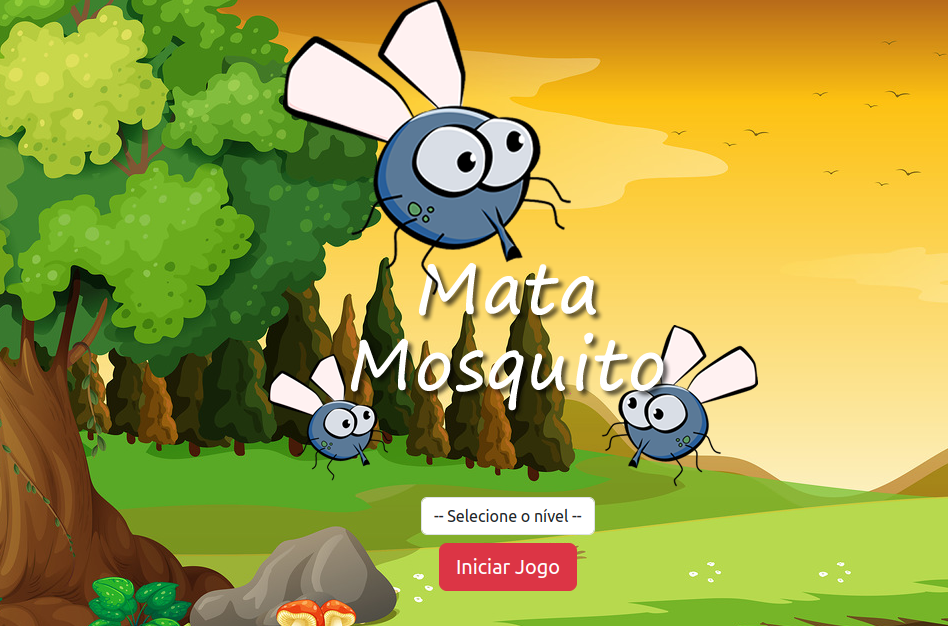

# Jogo Mata-Mosquito

Este é um simples jogo desenvolvido em JavaScript onde o objetivo é matar mosquitos que aparecem na tela. O jogador ganha pontos ao acertar os mosquitos e perde pontos se deixar algum escapar.

## Como Jogar

1. Abra o arquivo `index.html` em seu navegador.
2. Escolha o nível de dificuldade.
3. Clique nos mosquitos que aparecem na tela para matá-los.
4. Evite que os mosquitos escapem da tela, pois isso resultará na perda de pontos.

## Recursos

- Interface simples e intuitiva.
- Pontuação atualizada conforme você mata os mosquitos.
- Efeitos sonoros para uma experiência mais imersiva.

## Contribuindo

Se você quiser contribuir com melhorias para o jogo, sinta-se à vontade para abrir uma issue ou enviar um pull request. Toda contribuição é bem-vinda!

## Licença

Este projeto está licenciado sob a [Licença MIT](LICENSE).
